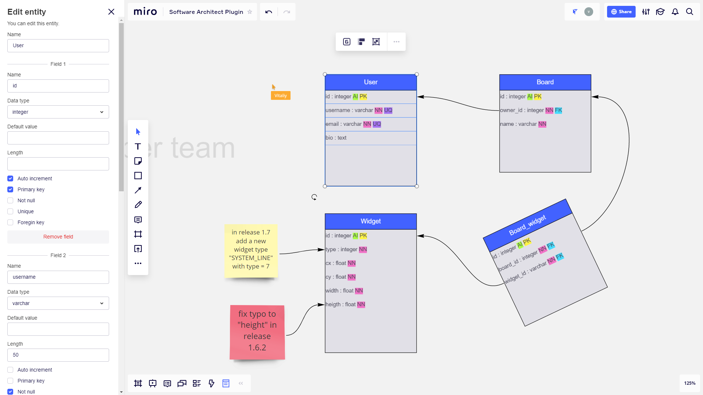
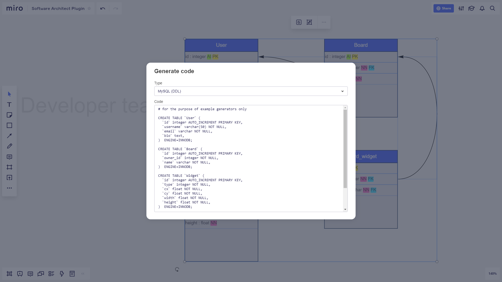

## Software Architect

[Miro](https://miro.com) plugin for collaborative design of database schema with ability to generate code.

    
    

### Get in Miro

Follow [this link](https://miro.com/oauth/authorize/?response_type=token&client_id=3074457347056248071&redirect_uri=/) and add plugin to your team.

### Features

- Creating Database schema entities
- Editing entity name and fields interactively via forms
- Generating code (like MySQL DDL and others)

### Technical details

- Uses server only for static files (stores data in widgets metadata)
- Uses preact and webpack for minimizing bundle size

### Development mode

- Clone this repo
- Install dependencies (`$ npm install`)
- Edit `APP_ID` in `./src/Config.ts`
- Run webpack dev server (`$ npm start`)
- App available at https://127.0.0.1:9000
- Add SSL certificate to browser exceptions
